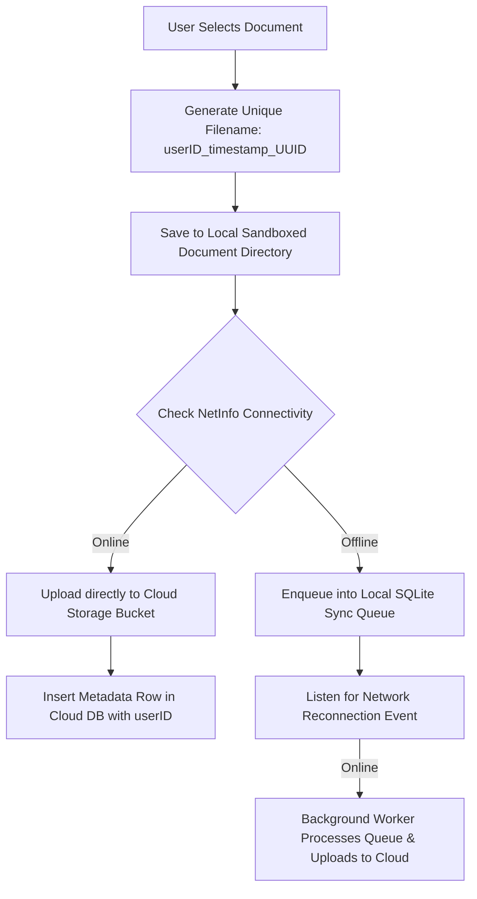

# Focus Vault: Mobile Offline-First Cloud Sync Architecture

This document specifies the complete engineering architecture, database schemas, local sandboxed storage logic, background queue processor, and multi-tenant security paradigms for the **Focus Vault** mobile document management system.

---

## 🏗️ Architecture & Sync Flow Diagram



---

## 1. Local Storage Setup & Collision-Proof Naming

### Recommended Secure Local Storage Libraries (React Native / Expo)
1. **File System Sandboxing (`expo-file-system` / `react-native-fs`)**:
   - Stores physical PDF, Word DOCX, and image files inside the mobile app's private sandboxed `documentDirectory`.
2. **Encrypted Key-Value Storage (`expo-secure-store` / `react-native-keychain`)**:
   - Stores user JWT auth tokens and sensitive API credentials securely using iOS Keychain or Android Keystore.
3. **Local Queue Database (`expo-sqlite` / `WatermelonDB`)**:
   - Stores offline upload tasks persistently across app restarts.

### Collision-Proof Naming Scheme
To guarantee that files never overwrite one another locally or inside cloud storage buckets (even if multiple users upload a file named `Resume.pdf` or `StudyNotes.docx`), all filenames are transformed using:
`{userID}_{timestamp}_{uuidv4}.{extension}`

### `vaultFileManager.ts`
```typescript
import * as FileSystem from 'expo-file-system';
import * as DocumentPicker from 'expo-document-picker';
import 'react-native-get-random-values';
import { v4 as uuidv4 } from 'uuid';

export interface LocalVaultFile {
  id: string;
  userId: string;
  localPath: string;
  originalName: string;
  uniqueFileName: string;
  mimeType: string;
  size: number;
  createdAt: number;
  syncStatus: 'PENDING' | 'SYNCED' | 'FAILED';
}

/**
 * Picks a document and securely copies it into the app's sandboxed Document Directory
 * with a collision-proof unique filename.
 */
export async function saveFileToVaultLocal(userId: string): Promise<LocalVaultFile | null> {
  try {
    const result = await DocumentPicker.getDocumentAsync({
      type: ['application/pdf', 'image/*', 'application/msword', 'text/plain'],
      copyToCacheDirectory: true
    });

    if (result.canceled || !result.assets || result.assets.length === 0) {
      return null;
    }

    const pickedFile = result.assets[0];
    const timestamp = Date.now();
    const uuid = uuidv4().slice(0, 8);
    const extension = pickedFile.name.split('.').pop() || 'dat';
    const uniqueFileName = `${userId}_${timestamp}_${uuid}.${extension}`;
    const destinationPath = `${FileSystem.documentDirectory}vault_documents/${uniqueFileName}`;

    const dirInfo = await FileSystem.getInfoAsync(`${FileSystem.documentDirectory}vault_documents`);
    if (!dirInfo.exists) {
      await FileSystem.makeDirectoryAsync(`${FileSystem.documentDirectory}vault_documents`, { intermediates: true });
    }

    await FileSystem.copyAsync({
      from: pickedFile.uri,
      to: destinationPath
    });

    return {
      id: uuidv4(),
      userId,
      localPath: destinationPath,
      originalName: pickedFile.name,
      uniqueFileName,
      mimeType: pickedFile.mimeType || 'application/octet-stream',
      size: pickedFile.size || 0,
      createdAt: timestamp,
      syncStatus: 'PENDING'
    };
  } catch (error) {
    console.error('Error saving local vault document:', error);
    throw error;
  }
}
```

---

## 2. Cloud Sync & Database Schema

### SQL Database Schema (`vault_materials`)
```sql
CREATE TYPE vault_file_type AS ENUM ('document', 'image', 'link', 'archive');

CREATE TABLE public.vault_materials (
    id UUID PRIMARY KEY DEFAULT gen_random_uuid(),
    user_id UUID NOT NULL REFERENCES auth.users(id) ON DELETE CASCADE,
    title VARCHAR(255) NOT NULL,
    original_name VARCHAR(255) NOT NULL,
    unique_file_name VARCHAR(255) UNIQUE NOT NULL,
    storage_bucket_path VARCHAR(512) NOT NULL,
    cloud_url TEXT NOT NULL,
    mime_type VARCHAR(128) NOT NULL,
    file_size_bytes BIGINT NOT NULL DEFAULT 0,
    file_type vault_file_type NOT NULL DEFAULT 'document',
    is_starred BOOLEAN DEFAULT FALSE,
    created_at TIMESTAMPTZ DEFAULT NOW(),
    updated_at TIMESTAMPTZ DEFAULT NOW()
);

CREATE INDEX idx_vault_materials_user_id ON public.vault_materials(user_id);
CREATE INDEX idx_vault_materials_created_at ON public.vault_materials(created_at DESC);
```

### `cloudUploader.ts`
```typescript
import * as FileSystem from 'expo-file-system';
import { LocalVaultFile } from './vaultFileManager';

const CLOUD_API_UPLOAD_URL = 'https://api.yourdomain.com/v1/vault/upload';

export async function syncFileToCloud(
  localFile: LocalVaultFile,
  authToken: string
): Promise<{ cloudUrl: string; materialId: string }> {
  try {
    const response = await FileSystem.uploadAsync(CLOUD_API_UPLOAD_URL, localFile.localPath, {
      fieldName: 'file',
      httpMethod: 'POST',
      uploadType: FileSystem.FileSystemUploadType.MULTIPART,
      headers: {
        'Authorization': `Bearer ${authToken}`,
        'X-User-ID': localFile.userId,
        'X-Original-Filename': encodeURIComponent(localFile.originalName),
        'X-Unique-Filename': localFile.uniqueFileName,
        'X-Mime-Type': localFile.mimeType
      },
      parameters: {
        userId: localFile.userId,
        title: localFile.originalName.replace(/\.[^/.]+$/, ''),
        uniqueFileName: localFile.uniqueFileName
      }
    });

    if (response.status !== 200 && response.status !== 201) {
      throw new Error(`Cloud sync failed with HTTP status ${response.status}: ${response.body}`);
    }

    const result = JSON.parse(response.body);
    return { cloudUrl: result.cloudUrl, materialId: result.materialId };
  } catch (error) {
    console.error(`Failed uploading ${localFile.uniqueFileName} to cloud:`, error);
    throw error;
  }
}
```

---

## 3. Offline Queue & Network Reconnection Sync Engine

### `syncQueueService.ts`
```typescript
import NetInfo from '@react-native-community/netinfo';
import * as SQLite from 'expo-sqlite';
import { LocalVaultFile } from './vaultFileManager';
import { syncFileToCloud } from './cloudUploader';

const db = SQLite.openDatabaseSync('focus_vault_sync.db');

export function initSyncQueueDatabase() {
  db.execSync(`
    CREATE TABLE IF NOT EXISTS upload_queue (
      id TEXT PRIMARY KEY,
      user_id TEXT NOT NULL,
      local_path TEXT NOT NULL,
      original_name TEXT NOT NULL,
      unique_file_name TEXT NOT NULL,
      mime_type TEXT NOT NULL,
      size INTEGER NOT NULL,
      created_at INTEGER NOT NULL,
      retry_count INTEGER DEFAULT 0
    );
  `);
}

export async function enqueueOrSyncVaultDocument(
  file: LocalVaultFile,
  authToken: string
): Promise<{ status: 'SYNCED' | 'QUEUED' }> {
  const netState = await NetInfo.fetch();

  if (netState.isConnected && netState.isInternetReachable !== false) {
    try {
      await syncFileToCloud(file, authToken);
      return { status: 'SYNCED' };
    } catch (err) {
      console.warn('Immediate sync failed, falling back to offline queue:', err);
    }
  }

  db.runSync(
    `INSERT INTO upload_queue (id, user_id, local_path, original_name, unique_file_name, mime_type, size, created_at)
     VALUES (?, ?, ?, ?, ?, ?, ?, ?)`,
    [file.id, file.userId, file.localPath, file.originalName, file.uniqueFileName, file.mimeType, file.size, file.createdAt]
  );

  return { status: 'QUEUED' };
}

export async function processOfflineUploadQueue(authToken: string) {
  const netState = await NetInfo.fetch();
  if (!netState.isConnected) return;

  const pendingFiles = db.getAllSync<LocalVaultFile>(`SELECT * FROM upload_queue ORDER BY created_at ASC`);
  if (pendingFiles.length === 0) return;

  for (const item of pendingFiles) {
    try {
      const localFile: LocalVaultFile = {
        id: item.id,
        userId: item.userId || (item as any).user_id,
        localPath: item.localPath || (item as any).local_path,
        originalName: item.originalName || (item as any).original_name,
        uniqueFileName: item.uniqueFileName || (item as any).unique_file_name,
        mimeType: item.mimeType || (item as any).mime_type,
        size: item.size,
        createdAt: item.createdAt || (item as any).created_at,
        syncStatus: 'PENDING'
      };

      await syncFileToCloud(localFile, authToken);
      db.runSync(`DELETE FROM upload_queue WHERE id = ?`, [item.id]);
    } catch (err) {
      db.runSync(`UPDATE upload_queue SET retry_count = retry_count + 1 WHERE id = ?`, [item.id]);
    }
  }
}

export function startNetworkSyncListener(getAuthToken: () => Promise<string>) {
  return NetInfo.addEventListener(async (state) => {
    if (state.isConnected && state.isInternetReachable) {
      const token = await getAuthToken();
      if (token) {
        await processOfflineUploadQueue(token);
      }
    }
  });
}
```

---

## 4. Multi-Tenant Security & Isolation Rules

### Option A: Supabase / PostgreSQL Row-Level Security (RLS)
```sql
ALTER TABLE public.vault_materials ENABLE ROW LEVEL SECURITY;

CREATE POLICY "Strict User Isolation Policy" ON public.vault_materials
    FOR ALL
    USING (auth.uid() = user_id)
    WITH CHECK (auth.uid() = user_id);

CREATE POLICY "Users can only access storage under their UserID prefix" ON storage.objects
    FOR ALL
    USING (bucket_id = 'vault_documents' AND (storage.foldername(name))[1] = auth.uid()::text)
    WITH CHECK (bucket_id = 'vault_documents' AND (storage.foldername(name))[1] = auth.uid()::text);
```

### Option B: Firebase Storage Security Rules
```javascript
rules_version = '2';
service firebase.storage {
  match /b/{bucket}/o {
    match /vault_documents/{userId}/{fileName} {
      allow read, write: if request.auth != null 
                         && request.auth.uid == userId
                         && request.resource.size < 50 * 1024 * 1024;
    }
  }
}
```

### Option C: Python Flask API Middleware (`material_routes.py`)
```python
@material_routes.route('/<int:material_id>', methods=['GET'])
@token_required
def get_single_material(material_id):
    """Retrieve a single vault document by ID with strict multi-tenant JWT user isolation check"""
    current_user_id = request.current_user_id
    
    # Enforce SQL ownership check: query by both material ID AND current_user_id
    material = SessionMaterial.query.filter_by(id=material_id, user_id=current_user_id).first()
    
    # If no match exists, return 403/404 instantly
    if not material:
        return jsonify({"error": "Unauthorized: Document not found or access denied"}), 403
        
    return jsonify({"material": material.to_dict()}), 200
```
